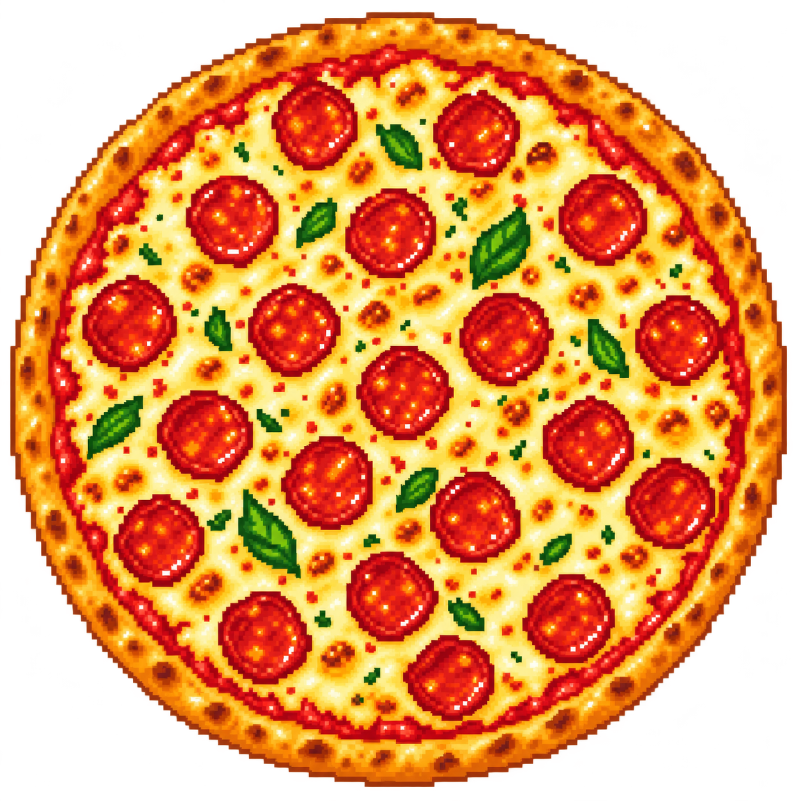

<p align="center">
  
</p>

<h1 align="center">Пицца поровну</h1>

<p align="center">
  Антиконфликтный калькулятор для голодной компании.<br>
  Считаем угол, показываем разметку, спасаем дружбу.
</p>

<p align="center">
  <a href="https://pizza-porovnu.ru">Открыть сайт</a>
</p>

## Что умеет

- Принимает от 1 до 100 гостей.
- Считает угол равного кусочка: `360° / количество людей`.
- Для чётного числа гостей показывает сквозные разрезы через центр.
- Для нечётного — надрезы от центра к корочке.
- Рисует разметку прямо поверх пиксельной пиццы.

## Пример

Для 15 человек каждый кусочек занимает `24°`: нужно сделать 15 надрезов от центра к корочке.

## Стек

React · TypeScript · Vite/Vinext · Tailwind CSS

## Запуск локально

Нужен Node.js 22.13 или новее.

```bash
npm ci
npm run dev
```

## Сборка

```bash
npm run build
```

## Размещение

Продакшен-сайт обслуживается как статика с сервера. Конфигурация домена для Caddy лежит в [deploy/Caddyfile](deploy/Caddyfile).
